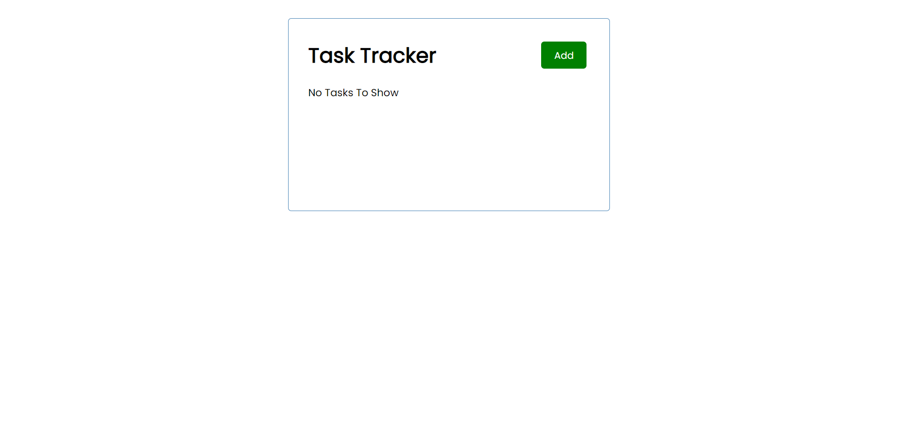
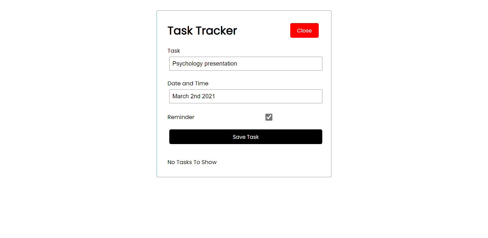
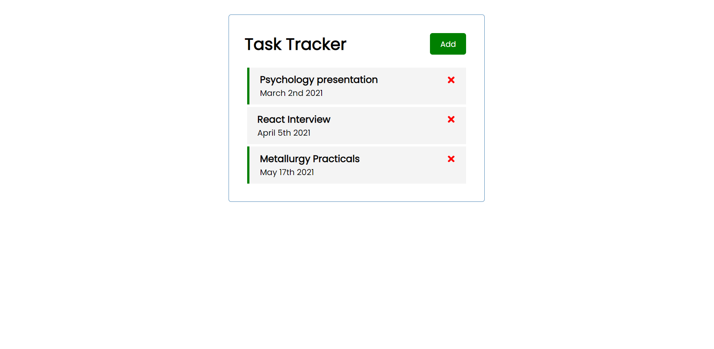

# Task Tracker React App

[View this project](https://friendly-pike-698fca.netlify.app/)

This is a todo-list reminder app built with React, Redux, and React Bootstrap. 
The app will help you keep track of important tasks and when they are due. 
This app will use cookies to continually keep track of your tasks even after leaving the app redux for global state storing of tasks, and react boot strap for simple CSS styling elements.

